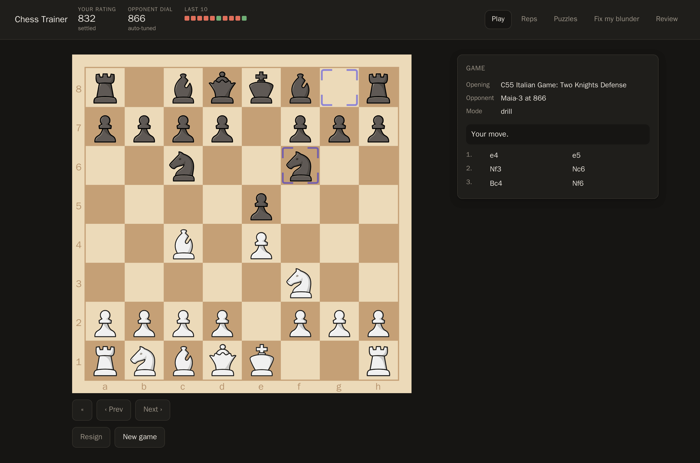
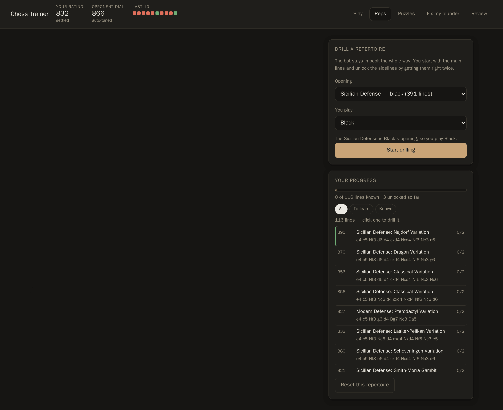
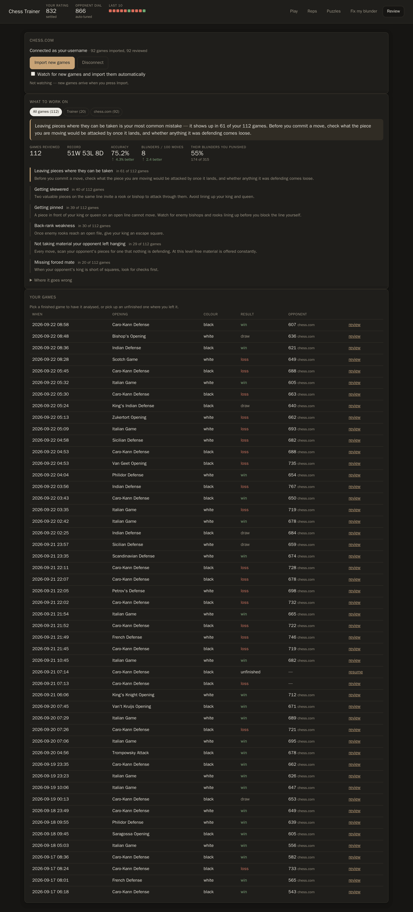
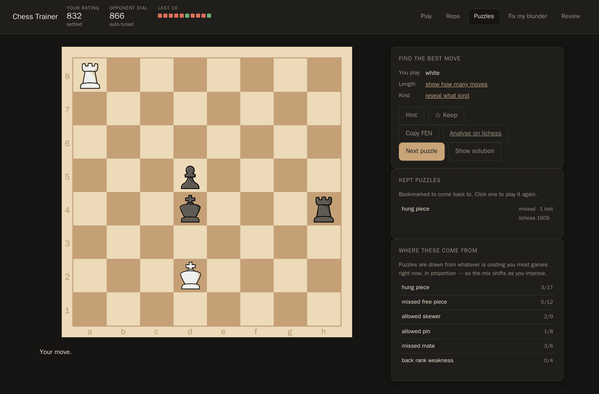
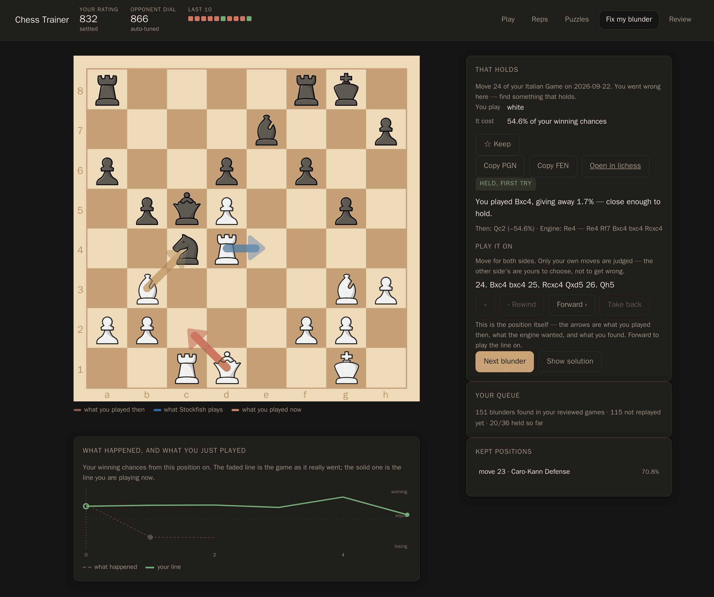
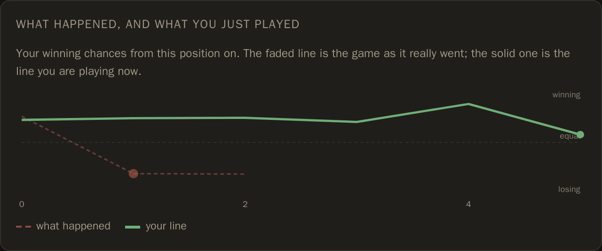

# Chess Trainer

A self-hosted chess trainer for a beginner, calibrated for one throughout.

Every chess tool is tuned for strong players in two places at once: the weakest
opponent it can offer, and the point at which it calls a move bad. Stockfish's
floor is 1320 Elo and lichess's "blunder" threshold was fitted on 2300+ games.
At 550 both are wrong, and the result is a bot that plays perfectly for ten
moves and then hangs a queen, judged by a yardstick that shouts at positions
you would still win half the time.

So the opponent here is **Maia-3**, a model trained to predict human moves,
sampled rather than argmaxed — taking the *most likely* move of a rating band
plays materially above that band, which is why lichess's "maia1100" bot
performs around 1500. Stockfish is never the opponent, only the judge. And the
win% curve is refitted for beginners, so a mistake is called a mistake when it
actually costs you the game.

---

## Explore and drill openings

Search 3,810 catalogued openings, pick a line, and play it three ways — stay in
book, follow the line then improvise, or play from move one with no book at
all. Hanging a piece stops the game and offers the move back, because the
mistake is worth catching while you still remember choosing it.

Reps turn the same catalogue into a curriculum: every rep is a complete
variation ending on *your* move, a wrong move is explained and taken back
rather than ending the exercise, and a line only banks when you play it clean.

## Review your real games

Connect a chess.com account with **just a username** — no password, no OAuth,
nothing to revoke. Your games import and are analysed by the same pipeline as
the ones you play here, so the two are comparable rather than merely adjacent.
Stockfish decides what was bad; motif detectors decide what happened; a
language model writes the prose and is allowed no chess of its own. New games
are picked up automatically about a minute after you finish them.

## Puzzles for your own weaknesses

Not a generic puzzle stream. The app already measures which mistakes cost you
games — hanging pieces in 7 of 9, pins in 6 — and Lichess publishes its whole
puzzle database under CC0 with a matching theme on every puzzle. So the two
worst motifs pick the puzzles, at a rating band just above yours, and the
selection moves as the weakness list does.

## Fix my blunder

Replays the exact positions you lost from: same board, same move number, same
choice. A move passes if it gives little away, not if it matches the engine's
string — at this level several moves are fine, and failing someone for a good
one teaches only that the app is arbitrary.

Then it draws both futures on one graph. The faded line is the game as it
really went; the solid one is the line you are playing now, and you can play it
on for both sides and watch them come apart. Only *your* moves are judged: the
other side's are yours to choose, not to get wrong.

Rewind through the line at any point without losing it, and branch off
somewhere else. Rewinding to the start puts the comparison back on the board —
what you played then, what the engine wanted, what you found instead.

Closer, the part that matters — the game collapsing while the line you are
playing holds:

[More on all four](docs/features.md)

---

## Docs

- **[Setup](docs/setup.md)** — running it, the container, the tests, licences.
- **[Features](docs/features.md)** — the manual: every mode, in detail.
- **[Design](docs/design.md)** — why it is built this way. The calibration
  thesis, the strength dial, what the coach is forbidden from doing, and what
  is knowingly still wrong.
- **[Roadmap](ROADMAP.md)** — what is next.

Licensed **AGPL-3.0**, by inheritance rather than preference — see
[Setup](docs/setup.md#licences).
